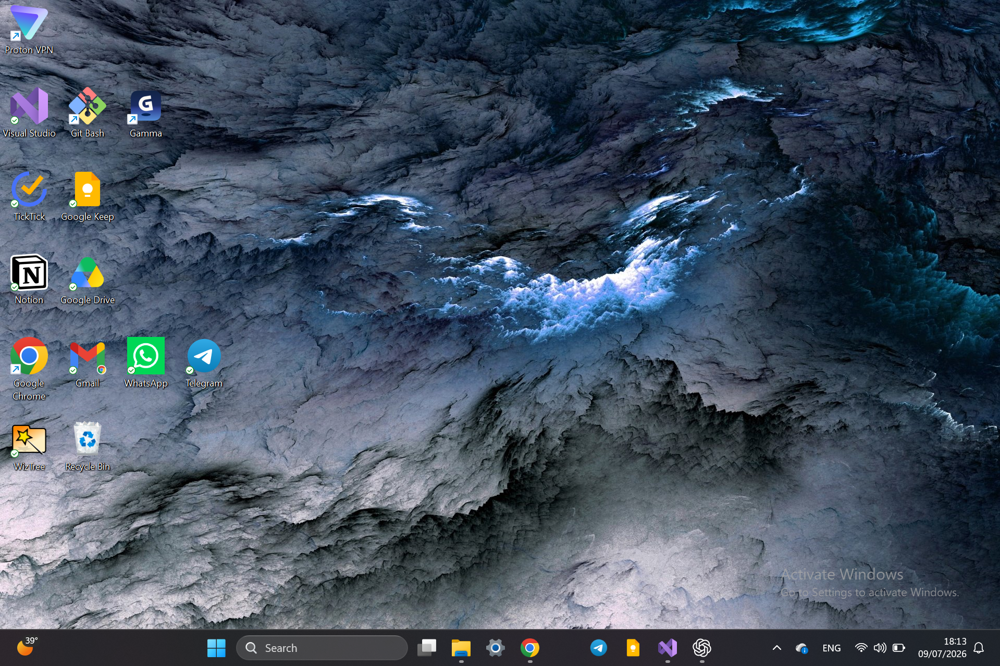
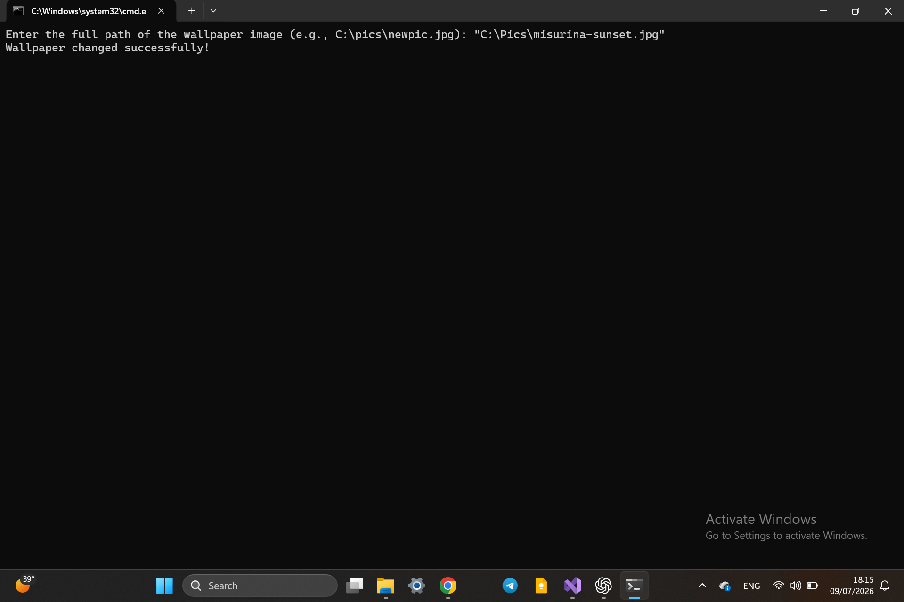
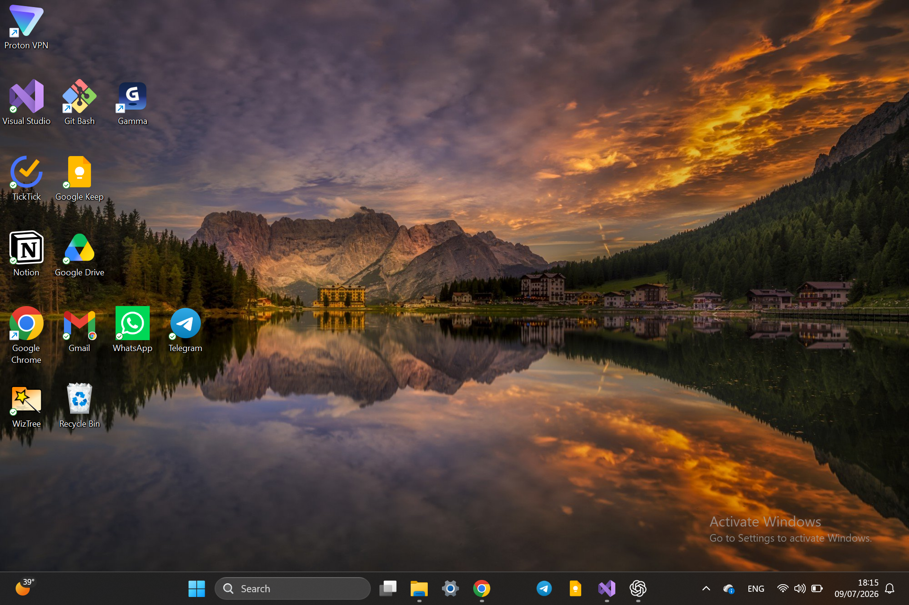

# Change Desktop Wallpaper

A C# console application that changes the Windows desktop wallpaper using the Windows API through P/Invoke.

## Technologies

- C#
- .NET
- Win32 API
- P/Invoke

## Windows API Used

`SystemParametersInfo()` from `user32.dll`

## Features

- Takes the wallpaper image path from the user
- Checks if the file exists
- Changes the Windows desktop wallpaper

## Screenshots

### Original Wallpaper

### Console Application

### New Wallpaper

---

## 👨‍💻 Author

Hazem Ahmad Hazem  
- GitHub: https://github.com/HazemAhmadHaz
- LinkedIn: https://www.linkedin.com/in/hazem-ahmad-haz
- Email: HazemAhmad01234@gmail.com
