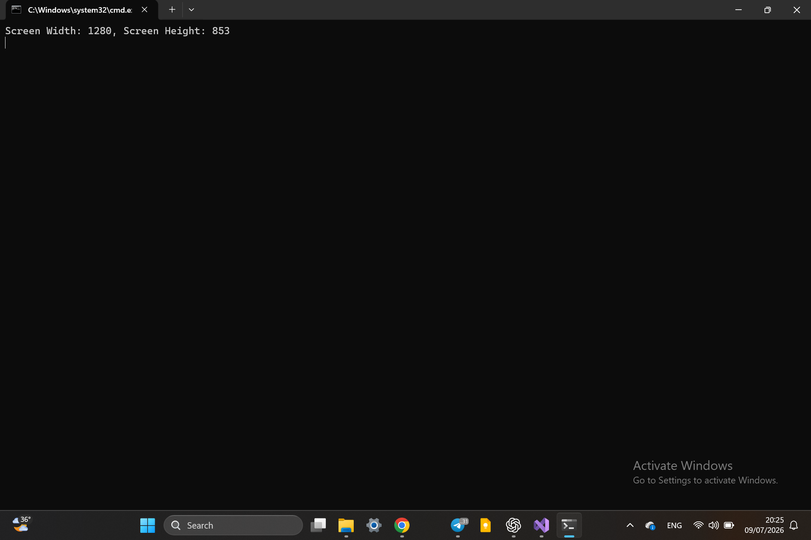

# Get Screen Resolution

A C# console application that retrieves the current screen resolution using the Win32 API through P/Invoke.

## Technologies

- C#
- .NET
- Win32 API
- P/Invoke

## Windows API Used

This project uses `GetSystemMetrics()` from `user32.dll` to retrieve the screen width and height.

## Features

- Retrieves the current screen width and height
- Displays the resolution in the console
- No external dependencies

## Preview
### Original Wallpaper

## Author

Hazem Ahmad Hazem

- GitHub: https://github.com/HazemAhmadHaz
- LinkedIn: https://www.linkedin.com/in/hazem-ahmad-haz
- Email: HazemAhmad01234@gmail.com
