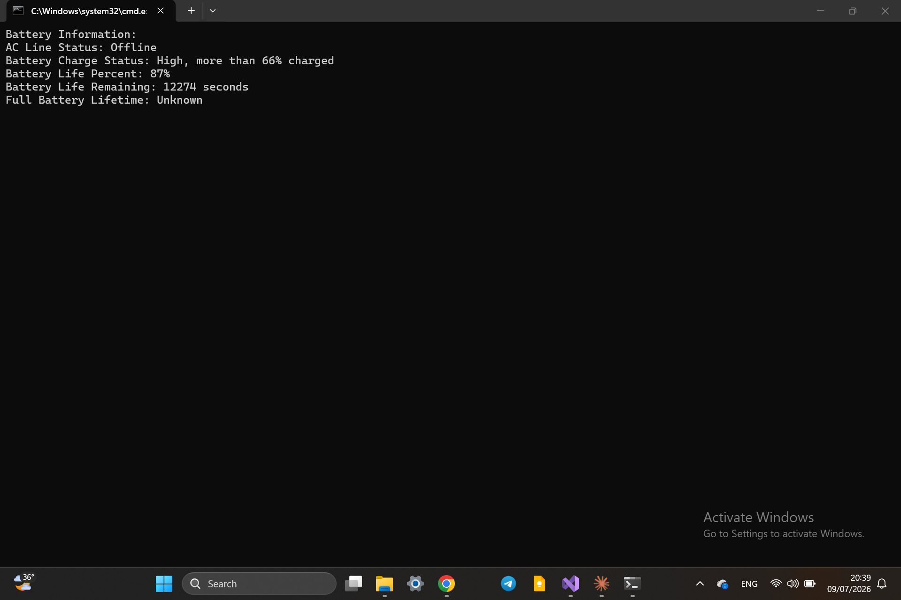

# Battery Info

A C# console application that retrieves the current battery status using the Win32 API through P/Invoke.

## Technologies

- C#
- .NET
- Win32 API
- P/Invoke

## Windows API Used

This project uses `GetSystemPowerStatus()` from `kernel32.dll` to retrieve battery and power status information.

## Features

- Displays battery charge percentage
- Shows whether the device is plugged in or on battery
- Displays power status details in the console

## Preview
### Battry Info

## Author

Hazem Ahmad Hazem

- GitHub: https://github.com/HazemAhmadHaz
- LinkedIn: https://www.linkedin.com/in/hazem-ahmad-haz
- Email: HazemAhmad01234@gmail.com
