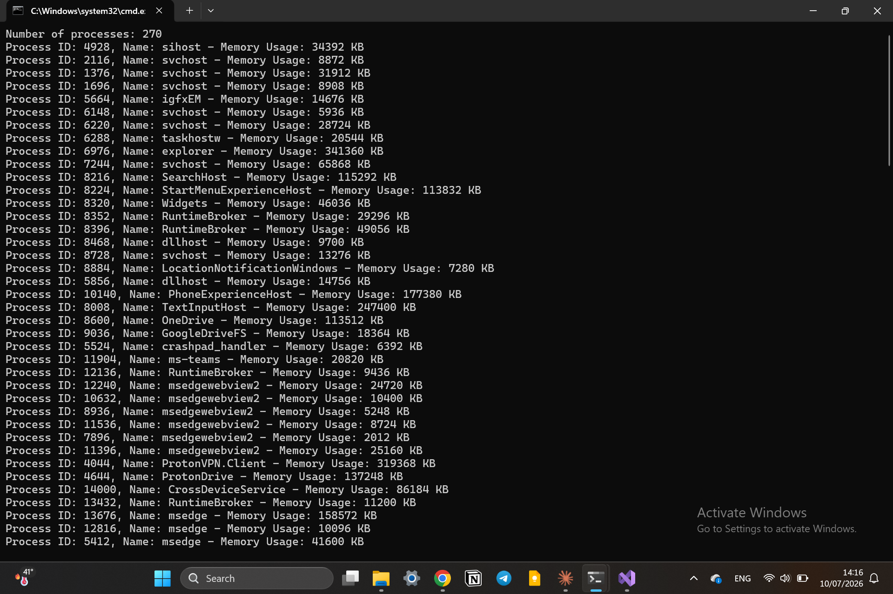

# Processes List

A C# console application that lists all running processes on the system, along with their process ID and memory usage, using the Win32 API through P/Invoke.

## Technologies

- C#
- .NET
- Win32 API
- P/Invoke

## Windows API Used

This project uses `EnumProcesses()`, `OpenProcess()`, and `GetProcessMemoryInfo()` from `psapi.dll` and `kernel32.dll` to enumerate running processes and retrieve their memory usage.

## Features

- Lists all currently running processes
- Displays the total number of processes
- Shows process ID, name, and memory usage for each process

## Preview

### Processes List

## Author

Hazem Ahmad Hazem

- GitHub: https://github.com/HazemAhmadHaz
- LinkedIn: https://www.linkedin.com/in/hazem-ahmad-haz
- Email: HazemAhmad01234@gmail.com