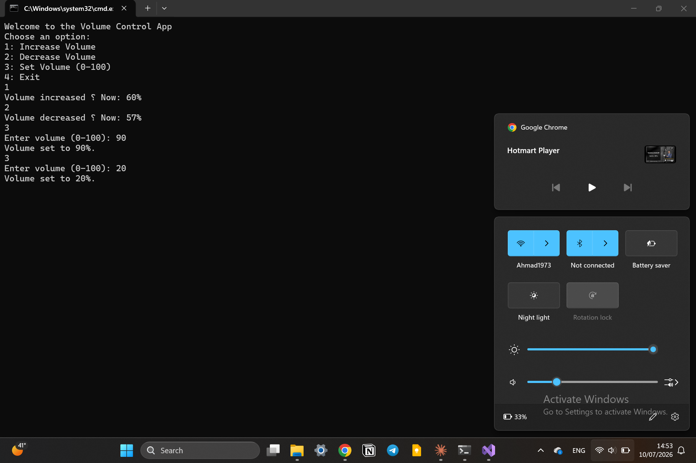
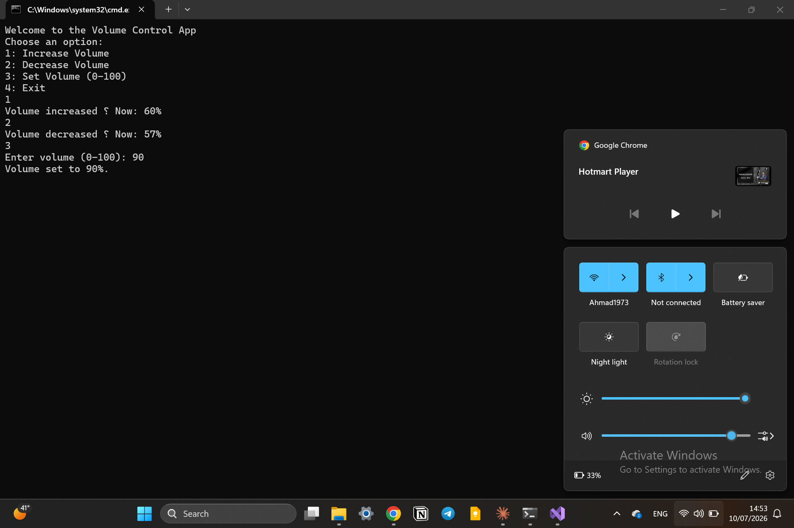

# Audio Volume Control

A C# console application that controls the system's audio volume using the NAudio library.

## Technologies

- C#
- .NET
- NAudio
- Core Audio API

## Windows API Used

This project uses `MMDeviceEnumerator` and `AudioEndpointVolume` from the **NAudio.CoreAudioApi** library to access and control the default audio device's volume.

## Features

- Increases system volume
- Decreases system volume
- Sets volume to a specific level (0-100)
- Displays the current volume percentage after each change

## Preview

  
  

## Author

Hazem Ahmad Hazem

- GitHub: https://github.com/HazemAhmadHaz
- LinkedIn: https://www.linkedin.com/in/hazem-ahmad-haz
- Email: HazemAhmad01234@gmail.com